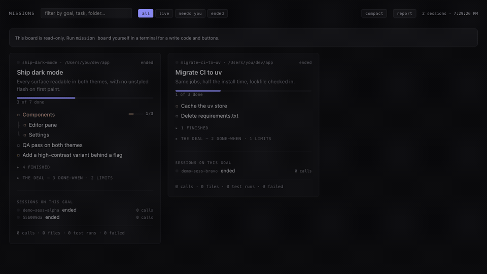

# mission

**The goal that outlives the detours — the agent cannot quietly rewrite it, and
you cannot quietly forget it.**

[](https://github.com/jlee844/agent-mission/actions/workflows/tests.yml)
[](pyproject.toml)
[](pyproject.toml)
[](LICENSE)

`mission` is a zero-dependency Python CLI plus a local web board for Claude
Code sessions. It separates three write authorities — **protected** objectives
(human-authored), **proposed** work (agent-suggested, human-accepted), and
**observable** state (evidence the agent records freely) — and verifies
completion claims against the filesystem before a human confirms them.
Integration: Claude Code hooks, a statusline, harness deny rules, the board.
Architecture: [one diagram, below the fold](#architecture). Reproduce every
claim: `pip install -e ".[dev]" && python -m pytest -q`.

Why it exists: two hours into a session there are 800 tool calls, a summary
written by the thing being summarised, and no easy answer to *what was this
for, and is it done?* `mission` writes the goal down once, somewhere the
agent cannot edit, and keeps putting it back in front of you.

```bash
pip install git+https://github.com/jlee844/agent-mission
mission setup      # slash command, deny rules, statusline, re-anchor hook, attention hook, claim hook
```

## Your whole job

| when | you do |
|---|---|
| once | answer the interview — `/mission init` asks what done looks like, one question at a time; your agent transcribes, never authors |
| per login | paste the write code the board prints in your terminal — the agent never sees it |
| when the strip lights | click **accept** on a proposed subgoal, **confirm** on a tick the disk corroborated |

Everything else runs itself. The statusline keeps the goal one glance away:
```
Ship list sharing · 2/5 · detour: chasing a flaky test · 3 proposals waiting
```

The mission re-anchors the agent after compaction; completion claims are checked
against the disk **in the turn they are made**; finished items arrive as
suggestions with the verdict attached — *"agent says done — disk agrees"* — and
one line lands in the conversation only when something *newly* needs you.
**Silence means on track.**

**The board is where you click.** `mission board` — every goal on one page: the
plan as a tree, and what each session **actually did** (calls, files, tests —
read from the transcript, not reported by the agent). A strip on top answers
*is anything waiting on me*.



Everything below the line is for the agent, or for scripting.
**Humans use the board; agents use the CLI.**

### Three levels of authority

| level | fields | who writes |
|---|---|---|
| 🔒 **protected** | objective, success criteria, constraints, non-goals | **you only** |
| 🟡 **proposed** | checklist, strategy | agent suggests, you accept |
| 🟢 **observable** | decisions, evidence, notes, detours | agent records freely |

Enforced in the store, at the terminal, and by Claude Code's deny rules —
[SECURITY.md](docs/SECURITY.md) says how, and what that does *not* cover.

### Why not just a TODO.md?

- **Every plan file is agent-writable** — "done" is self-reported by the thing
  being graded. Here, ticking is yours.
- **A plan file stops at a file nothing reads back.** This one comes to you.
- **Keep your planner:** `import` lands writing-plans / GSD / Kiro markdown as
  proposals, and diffs on re-import.

---

# Agent & scripting reference

## Architecture

The whole design in one picture — write authority flows down, and nothing
moves the counter except a human ruling on evidence:

```
                 human writes
                      ▼
        ┌─ PROTECTED ─────────────────┐
        │ objective · criteria        │
        │ constraints · non-goals     │
        └─────────────┬───────────────┘
              agent proposes
                      ▼
        ┌─ PROPOSED ──────────────────┐
        │ checklist · strategy        │      inert until accepted
        └─────────────┬───────────────┘
                 human accepts
                      ▼
        ┌─ OBSERVABLE ────────────────┐
        │ evidence · decisions        │      agent records freely
        │ detours · claims-done       │
        └─────────────┬───────────────┘
               disk corroborates
                      ▼
        ┌─ TICK ──────────────────────┐
        │ human confirms · by=human   │      one click, pre-evidenced
        └─────────────────────────────┘
```

Integration is one line: Claude Code hooks → append-only event log
(`~/.agent-mission/`) → statusline · signal · board · CLI. State is a fold
over the log, so *why does it say this* is always answerable by reading.

## Setup

`setup` finishes the job — it backs up your settings, appends to hooks instead
of replacing them, wraps an existing statusline keeping your original verbatim,
and refuses to touch anything unless a person is at the keyboard. Re-running it
is always the complete fix. `mission setup --check` shows what is live.
(Contributing? `git clone` and `pip install -e ".[dev]"` instead of the
one-liner.)

Opt-in, never installed by default: `--auto-board` starts a writable board
from your shell rc at login (one code paste per day, buttons thereafter);
`--notify` adds an OS notification when a proposal lands (edge-triggered, max
one per 10 minutes).

## Commands

| command | what it does |
|---|---|
| `init` | interview and write the mission (`--from-file`, `--force --discard-plan`) |
| `show` | the goal, the plan, measured activity (`--all` includes finished) |
| `whereami` | one line for a statusline (`--full` = the re-anchor + protocol payload) |
| `pending` | what awaits your accept, and the command that clears it |
| `add` / `propose` | add agreed work / suggest it (inert until accepted; `--under <id>`) |
| `accept` / `done` / `remove` | rule on proposals, tick work, drop subtrees (`--pending`, `--under`) |
| `set` | change a protected field, keeping the plan and the history |
| `why <field>` | when it changed, to what, and who typed it |
| `attach` / `missions` | point this session at a goal / list every goal |
| `archive` / `migrate` | take a finished goal off the board (`--undo`) / lift old stores |
| `detour` / `return` | declare a side quest; return replays the goal |
| `observe` | record evidence, a decision, or a note |
| `import <file>` / `delegate <id>` | land an external plan as proposals / spin one item into a subagent session |
| `signal` | one line if something newly awaits you; silent otherwise (for hooks) |
| `claims-done <id> <text>` | suggest an accepted item is finished; the board attaches the disk's verdict |
| `claims` | verify recent completion claims against the disk; silent when backed (for hooks) |
| `doctor` | what is wrong with the missions themselves, not the install |
| `board` | the shared board; at a tty it is writable (`--stop`) |
| `setup` / `help <cmd>` / `version` | install; usage without running; the build + every live command |

## Addressing

**Names route, sessions speak, directories inform.** `--on <name>` is the only
address, and it reaches both storage layouts:

```bash
mission attach career                      # this session serves that goal
mission set objective "Ship invites too" --on career
mission accept --pending --on career
```

The session id in the environment says *who is writing*, never what is meant.
The working directory says neither and is not consulted — a cwd router existed
once, misrouted a real write, and died ([DESIGN.md](docs/DESIGN.md) has the
post-mortem). When nothing names a goal, `mission` refuses and lists yours,
each with a paste-ready command.

## The board, precisely

**One board per store.** Starting a second finds the first. It lives at
`127.0.0.1:8976` and returns there after restarts; `~/.agent-mission/board.html`
is a bookmark that never goes stale. Writes are gated by a code printed only
to the terminal of the person who started it — kept in memory, never on disk,
never served; wrong guesses lock out. Colour on the board means one thing:
the warm accent is *waiting on you*. The muted hues on the tree are structure
— rows under one subgoal share their domain's colour, assigned by a keyword
table, not a classifier.

## Limitations

- **Outside Claude Code you must name the goal** — `--on` autocompletes
  nothing, which is why `init` insists on a short memorable name.
- **Progress is measured or marked, never inferred.** No drift detection, on
  purpose — [DESIGN.md](docs/DESIGN.md) has the five dead detectors.
- **The event log is a plain file.** An agent with shell access can forge an
  append. The guarantee is no *silent* rewrite through this tool's interfaces,
  not tamper-proofness.
- **Not on PyPI.** Install from source.

## Docs

- [DESIGN.md](docs/DESIGN.md) — why it is shaped this way; the five dead drift detectors
- [SECURITY.md](docs/SECURITY.md) — what is enforced, and the honest limits
- [adversarial-testing.md](docs/adversarial-testing.md) — how the authority model got broken, twice, and what each break bought
- [evidence.md](docs/evidence.md) — every unusual claim, mapped to the artifact that substantiates it

## Part of a set

Four small tools that read what an AI coding session actually did, rather
than what it said it did.

| | |
|---|---|
| **mission** *(you are here)* | the goal, beside the work |
| [**receipt**](https://github.com/jlee844/receipt) | what a session did, what it cost, which claims are backed |
| [**blindspot**](https://github.com/jlee844/blindspot) | which changed lines a test would actually catch a bug in |
| [**transcript-audit**](https://github.com/jlee844/transcript-audit) | profile a transcript corpus before computing anything over it |

MIT.
