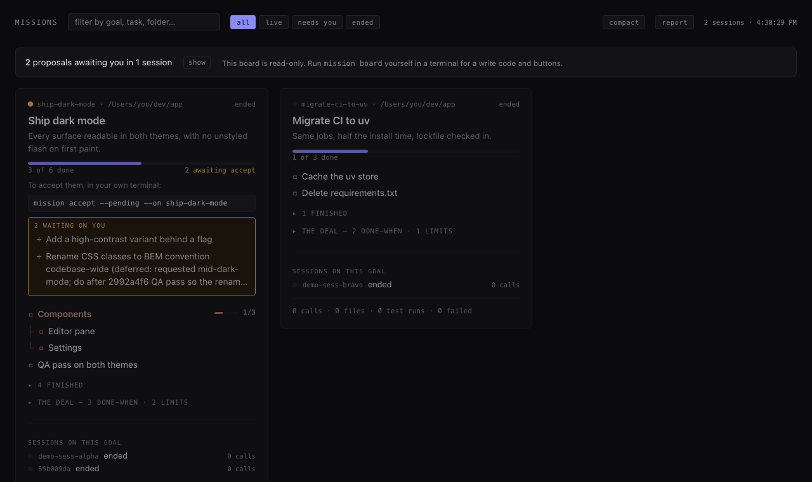

# mission

**The goal that outlives the detours — the agent cannot quietly rewrite it, and
you cannot quietly forget it.**

[](https://github.com/jlee844/agent-mission/actions/workflows/tests.yml)
[](pyproject.toml)
[](pyproject.toml)
[](LICENSE)

You start a session with something in mind. Two hours later there are 800 tool
calls, a summary written by the thing being summarised, and no easy answer to
*what was this for, and is it done?*

`mission` writes the goal down once, keeps it somewhere the agent cannot edit,
and puts it back in front of you — on your statusline, after a compaction, and
on one page showing every session you have running.



## Install

```bash
git clone https://github.com/jlee844/agent-mission && cd agent-mission
pip install -e .
mission setup      # slash command, deny rules, statusline, re-anchor hook
```

`setup` **finishes the job** rather than printing instructions — if you already
have a statusline it writes a wrapper that runs yours *and* appends the goal,
keeping your original verbatim. It backs up your settings, appends to hooks
instead of replacing them, and refuses to touch anything unless a person is at
the keyboard.

```bash
mission setup --check     # which surfaces are live here; exits 1 if any is missing
```

Re-running `mission setup` is always the complete fix. There is never a second
instruction to follow.

## Usage

```bash
mission init                 # interviews you, then writes it
mission                      # the goal, the plan, measured activity
mission whereami             # one line, for a statusline
mission detour "chasing a flaky test"
mission return               # replays the goal and the guards you set
mission board                # every live session on one page
```

```
Ship list sharing · 2/5 · detour: chasing a flaky test · 3 proposals waiting
```

**Three levels of authority.** This is the whole design.

| level | fields | who writes |
|---|---|---|
| 🔒 **protected** | objective, success criteria, constraints, non-goals | **you only** |
| 🟡 **proposed** | checklist, strategy | agent suggests, you accept |
| 🟢 **observable** | decisions, evidence, notes, detours | agent records freely |

The agent cannot author a protected field, accept its own proposal, or tick an
item — enforced in the store, at the terminal, and by Claude Code's own deny
rules. See [SECURITY.md](docs/SECURITY.md) for how, and for what that does
*not* cover.

## Commands

| command | what it does |
|---|---|
| `init` | interview and write the mission (`--from-file`, `--force --discard-plan`) |
| `show` | the goal, the plan, measured activity (`--all` includes finished) |
| `whereami` | one line for a statusline (`--full` for the ~10-line re-anchor) |
| `pending` | what awaits your accept, and the command that clears it |
| `add` | add an agreed item (`--under <id>`) |
| `propose` | suggest an item; inert until accepted (`--into <session>`) |
| `accept` | accept proposals (`--pending`, `--under <id>`, or ids) |
| `done` | tick agreed work (`--under <id>`, or ids) |
| `remove` | drop items and their subtrees |
| `detour` / `return` | declare a side quest; return replays the goal |
| `set` | change a protected field, keeping the plan and the history |
| `why <field>` | when it changed, to what, and who typed it |
| `import <file>` | land an external plan as proposals; diffs on re-import |
| `delegate <id>` | give one accepted item its own session for a subagent |
| `observe <field> <text>` | record evidence, a decision, or a note |
| `board` | the shared board (`--stop`; run it yourself for write buttons) |
| `setup --check` | which surfaces are installed, missing, or outdated |
| `setup` | slash command, deny rules, statusline, hooks |
| `version` | the build, and every command that exists right now |

## The board

`mission board` shows every running session: its goal, its plan as a tree, and
what it has **actually done** — calls, files, test runs, failures, read from the
transcript rather than reported by the agent. A strip at the top answers the
question you arrive with: *is anything waiting on me.*

Run it yourself in a terminal and it prints a write code, which turns on accept,
tick and note buttons. The agent never sees that code — that is the point, and
[SECURITY.md](docs/SECURITY.md) explains the mechanism.

It lives at `127.0.0.1:8976` and **stays there**: the port is the lock and the
record is only a cache, so a restart returns to 8976, a board whose record was
lost is adopted rather than duplicated, and only a foreign process on that port
can push it elsewhere. `~/.agent-mission/board.html` is a bookmark that always
points at the live one — and says the board is down rather than sending you to a
dead URL.

## Limitations

- **Session discovery is Claude Code specific.** The store, the board and the
  CLI are not.
- **Progress is measured or marked, never inferred.** There is no drift
  detection here, on purpose — [DESIGN.md](docs/DESIGN.md) says what was tried.
- **The event log is a plain file.** An agent with shell access can append a
  forged event. The guarantee is no *silent* rewrite through this tool's
  interfaces, not tamper-proofness.
- **Not on PyPI.** Install from source.

## Docs

- [DESIGN.md](docs/DESIGN.md) — why it is shaped this way, and the five dead drift detectors
- [SECURITY.md](docs/SECURITY.md) — what is enforced, and the honest limits

## Part of a set

Four small tools that read what an AI coding session actually did, rather than
what it said it did.

| | |
|---|---|
| **mission** *(you are here)* | the goal, beside the work |
| [**receipt**](https://github.com/jlee844/receipt) | what a session did, what it cost, which claims are backed |
| [**blindspot**](https://github.com/jlee844/blindspot) | which changed lines a test would actually catch a bug in |
| [**transcript-audit**](https://github.com/jlee844/transcript-audit) | profile a transcript corpus before computing anything over it |

MIT.
